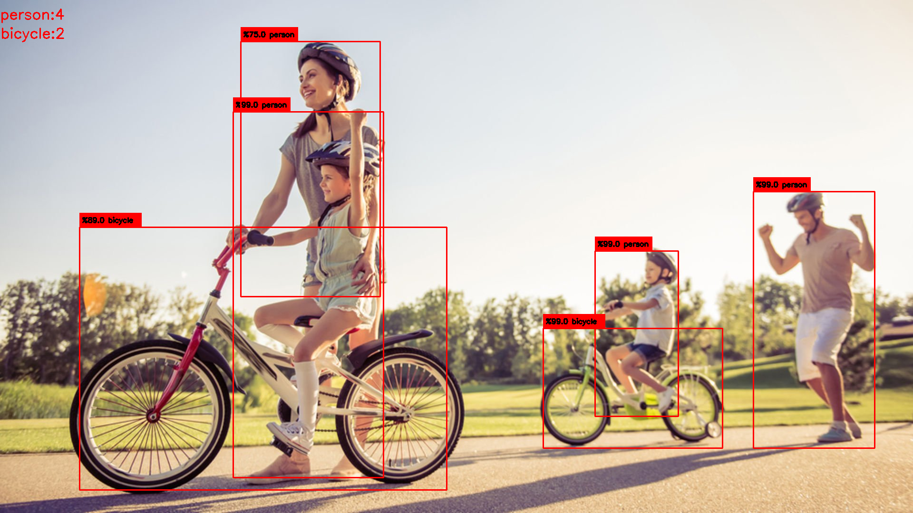
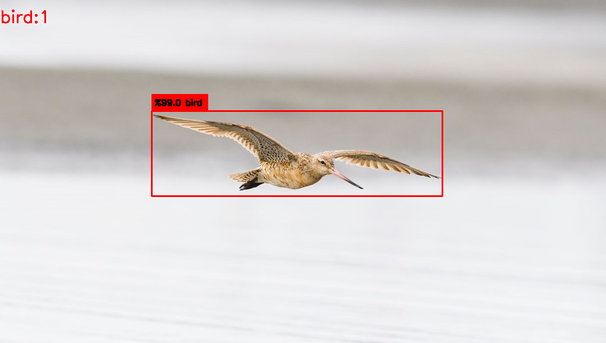

<div align="center">
<h1>
  Torchvision Kullanarak Detection Uygulaması Yap
</h1>
  
</div>

### Verinin Test Edilmesi

detect.py dosyasında değişiklik yapacağınız kod blokları:

  -Özel .pth dosyanızın yolunu belirtin.<br/>
  -Test edilecek görüntünün yolunu belirtin.<br/>
  -İmage Size & threshold değerlerinizi belirtin.<br/>
  
Bunlara ek olarak datasets.py dosyası içerisinde sınıf etiketlerinin belirtilmesi gerekmektedir.
```
if __name__ == '__main__':
    model = torchvision.models.detection.fasterrcnn_resnet50_fpn(pretrained=True) 
    model.load_state_dict(torch.load('model.pth')) # custom model path(.pth)
    model.eval()
    image = read_image("images/1.jpg", 512) # image path
    detect(image, model, threshold=0.5)
```





